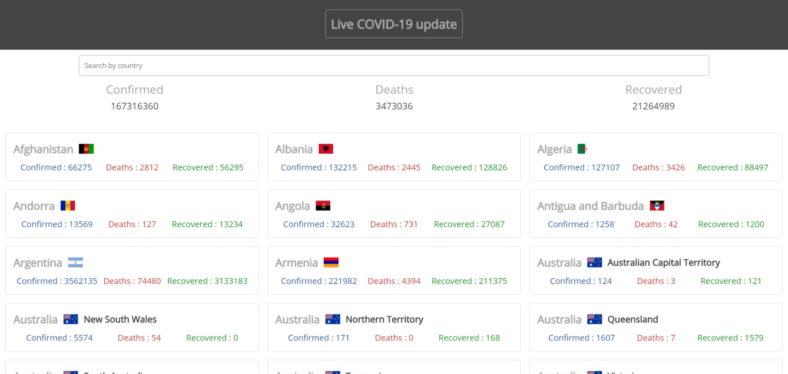

# COVID-19-update

Provides up-to-date data about Coronavirus outbreak. Includes numbers about confirmed cases, deaths and recovered. Support multiple data-sources.

## Features

- Shows global data of confirmed, deaths, and recovered cases.
- Provides country-wise data with their corresponding flags besides the country name.
- Shows state-wise data of countries.
- Data of specific country can be fetched through a simple search.

---

## View Live

https://mrsudarshanrai.github.io/covid-19-update
